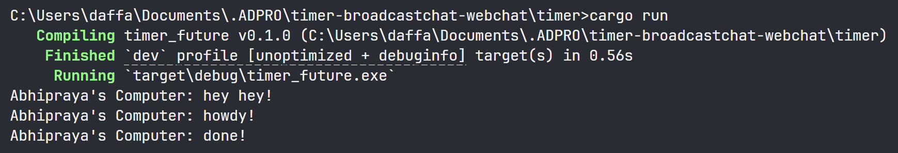
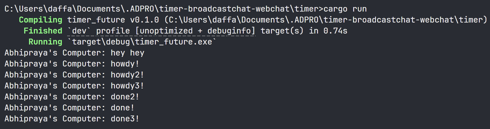
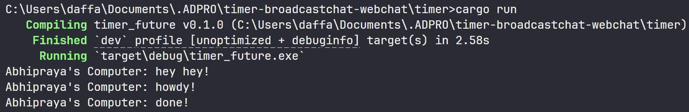
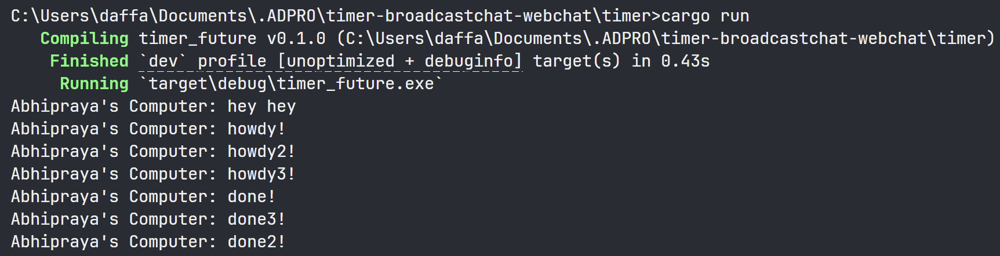

## Understanding What's Happening

### Print Outside Spawn

When the program runs, the first output you see is `hey hey`. This happens because the corresponding print statement is executed as part of the main function’s regular, synchronous flow—before any async tasks are handled.

The other two messages, "howdy!" and "done!", are generated inside an async block that is submitted to the executor. These messages are not printed right away. Instead, they appear only after the following sequence: the main function’s synchronous code finishes, the spawner is dropped (indicating no more tasks will be added), and finally, `executor.run()` is called to process the async tasks.

This sequence highlights a fundamental aspect of async programming: tasks spawned asynchronously are not executed immediately. They remain pending until the executor is explicitly told to process them, which happens after the synchronous code has run.

### Multiple Spawm

When multiple tasks are spawned and `drop(spawner)` is used, the program follows a specific execution order. The first output, `hey hey`, is printed synchronously from the `main()` function. After that, when `executor.run()` is called, it processes the three spawned tasks in the order they were added. Each task immediately prints its own `howdy` message, so you see all three `howdy` messages in succession. Once the `TimerFuture` in each task completes (after about two seconds), the tasks are re-queued. At this point, the executor processes the completed tasks in a last-in, first-out fashion, meaning the most recently re-added task is handled first. As a result, the `done` messages appear in reverse order from how the tasks were originally spawned.

### Removing Drop Spawner

**Single spawner, no drop:**

**Multiple spawner, no drop:**

If we omit the `drop(spawner)` line, the program doesn't exit after finishing the tasks because the communication channel between the spawner and executor stays open. The executor's run loop relies on `while let Ok(task) = self.ready_queue.recv()`, which keeps waiting for new tasks as long as the sender (the spawner) is still active. Without dropping the spawner, the executor remains stuck in this loop, anticipating more tasks that will never arrive.

As a result, whether there's one task or several, all their outputs appear as expected, but the program never finishes on its own—it just waits indefinitely. You have to manually stop it. Dropping the spawner is essential: it closes the channel, so `ready_queue.recv()` eventually fails, letting the executor's loop break and the program end cleanly.
